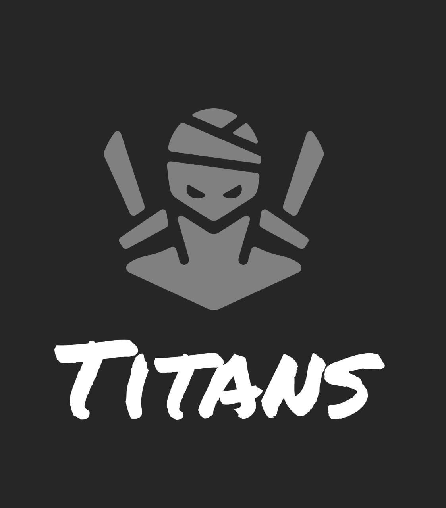
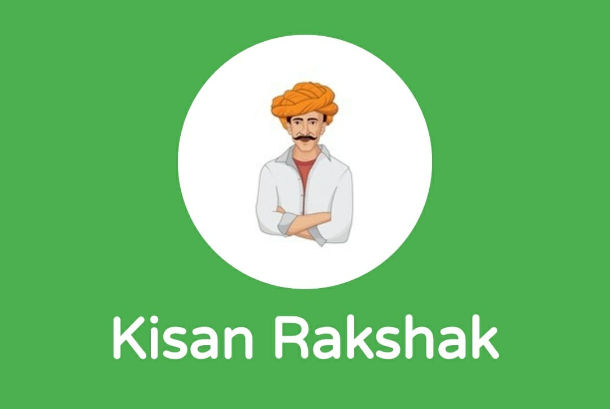
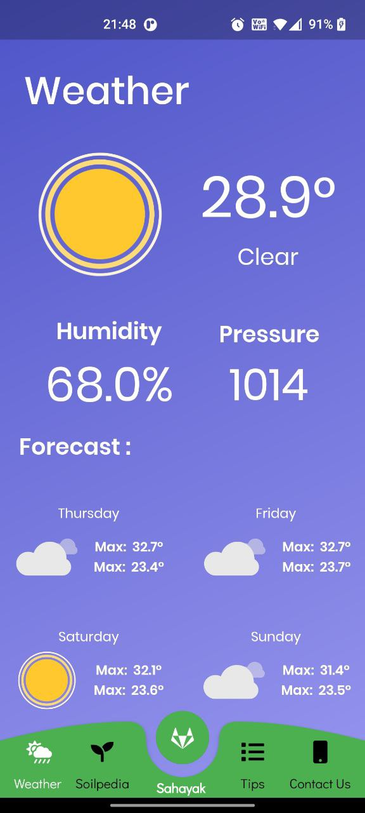
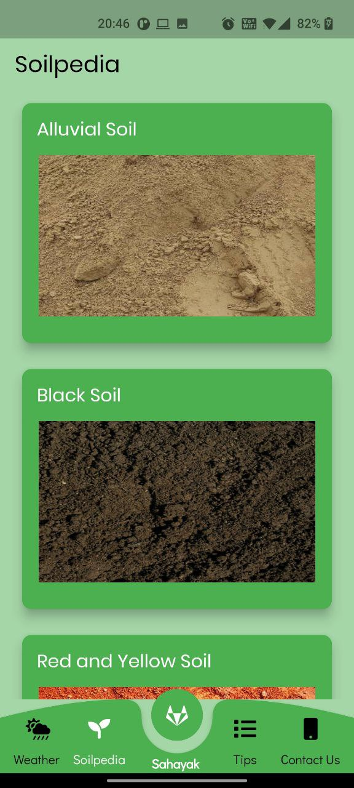
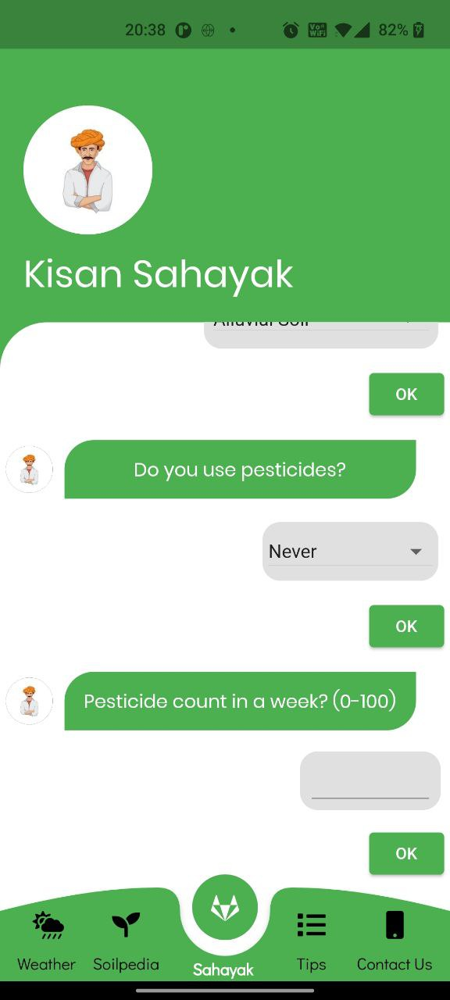
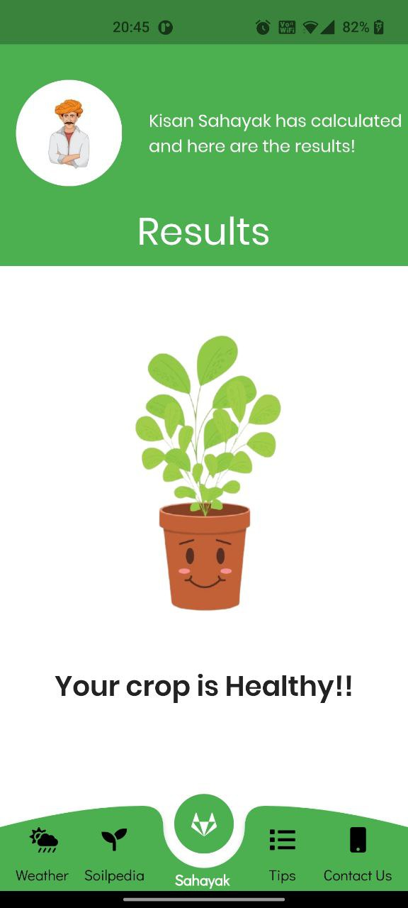
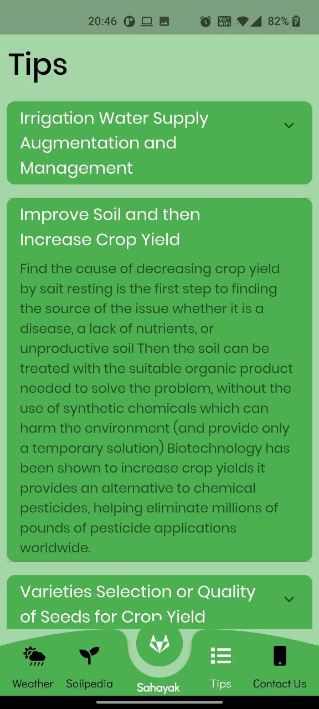

# Submission by Titans for Bit-by-Bit(IIIT Bhagalpur)
Entry of Titans, from SRM Institute of Science and Technology, Kattankulathur, to Bit-by-Bit(IIIT Bhagalpur).

<h2 align= "left"><b>Tracks and Theme</b></h2>

Track : App Development and AI

Theme :  Agriculture

## Problem Statement: 

The emerging concept of ***smart farming*** makes agriculture more efficient and effective with the help of high-precision algorithms. Our App allows the users to estimate whether the use of pesticides will damage their crop or not. This app also gives users important information like the weather, soil types, and tips for good farming.

## Our Product - Kisan Rakshak :

There are various functionalities in our app the most important being **Kisan Sahayak** which takes into account several factors such as availability of water, soil fertility, protecting crops from rodents, timely use of pesticides & other useful chemicals, and nature. While a lot of these factors are difficult to control, the amount and frequency of pesticides are something the farmer can control. **Kisan Sahayak** determines the outcome of the harvest season, i.e. whether the crop would be healthy (alive) or damaged by pesticides.
Our app also provides several other features such as realtime weather forecasts, detailed information about various soil, and suitable crops that can be grown in a particular soil. We also provide several useful tips to improve the harvest and much more.

## Preview : 

 &ensp;&ensp;&ensp;&ensp;&ensp;&ensp;&ensp;&ensp;&ensp;
 &ensp;&ensp;&ensp;&ensp;&ensp;&ensp;&ensp;&ensp;&ensp; 
 &ensp;&ensp;&ensp;&ensp;&ensp;&ensp;&ensp;&ensp;&ensp;
 &ensp;&ensp;&ensp;&ensp;&ensp;&ensp;&ensp;&ensp;&ensp;
 &ensp;&ensp;&ensp;&ensp;&ensp;&ensp;&ensp;&ensp;&ensp;
 &ensp;&ensp;&ensp;&ensp;&ensp;&ensp;&ensp;&ensp;&ensp;

<h2 align= "left"><b>Have Fun with our Product : </b></h2>

* App Link : [Download Here](https://tinyurl.com/KisanRakshak)
* Youtube Demo : [Video Demo](https://youtu.be/dQw4w9WgXcQ)

##### References(APIs Used) : 
 * Weather API : [Weather](https://openweathermap.org/)
 * Flask Backend(Made by Team) : [API](http://suvoo.pythonanywhere.com/)

<h2 align= "left"><b>Tech Stack Used : </b></h2>

*App*

- Flutter,Dart
- Android Studio

*Machine Learning*

- Python,Jupyter Notebook
- LGBM Classifier
- Flask and PythonAnywhere for Hosting

<h2 align= "left"><b>Project Maintainer(s)</b></h2>

<table>
<tr align="center">
  
  <td>
  
Abhijeet Gupta

</td>

<td>

Abhigyan Singh

</td>

<td>

Naman Jain

</td>

<td>

Suvodeep Sinha

</td>
</tr>

  </table>

## License

